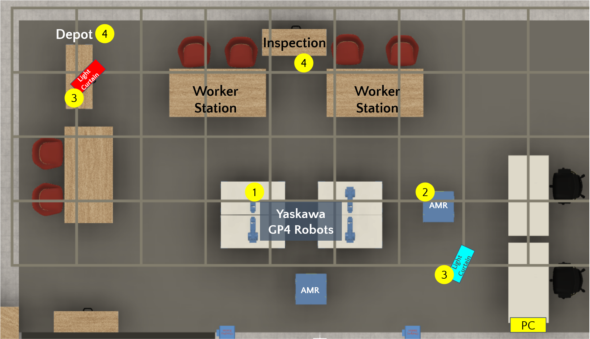

# System Overview

*<insert top down diagram>*

The testbed has been setup for assembly/disassembly of LEGO® blocks. The figure below shows physical resources available to execute a task through the pipeline.

## Resources 

Resources are entities that perform production activities. Listed below are the resources part of the Testbed v1.0.

1. **Robot Arms**: [Yaskawa GP4 robots](https://www.motoman.com/en-us/products/robots/industrial/assembly-handling/gp-series/gp4)
2. **Autonomous Robot Arms**: [Neobotix MP400](https://www.neobotix-robots.com/products/mobile-robots/mobile-robot-mp-400)
3. **Safety Light Curtains**: [ILIM Lab Programmable Light Curtains](https://www.cs.cmu.edu/~ILIM/light_curtains/)
4. **Depot/Inspection**: Human operated stations
5. **Manufacturing Execution System** (MES): Finite capacity scheduler that plans tasks for resources to fulfill order(s).

## System Architecture

MES acts as the conductor in the symphony of the production by planning and assigning tasks to other resources. It communicates using `POST` messages with resource web servers which gives resources flexibility. For example, in the above architecture there are human operated stations, ROS1 based system resource and a ROS2 based system resource.